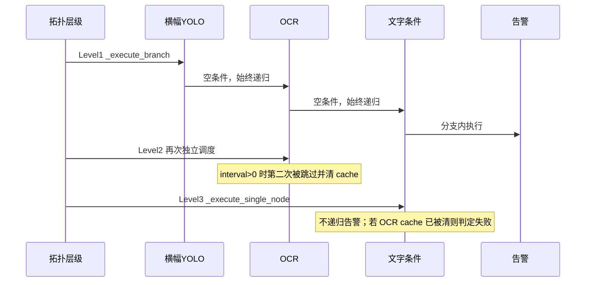
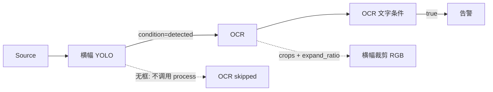
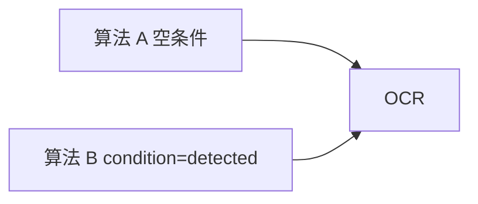
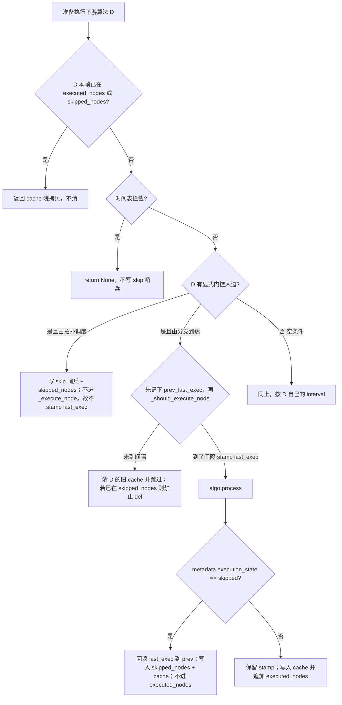
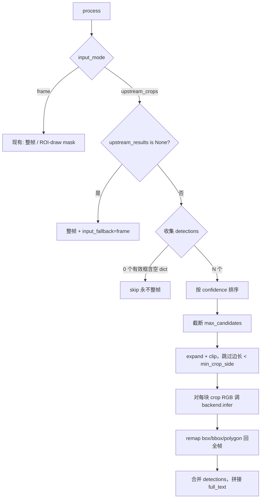

# 工作流门控串行：检测后再 OCR（横幅文字检测）

| 字段 | 值 |
| --- | --- |
| 文档标题 | Gated Sequential Algorithm Execution for Detect-then-OCR |
| 项目 | video-ba-pipe |
| 作者 | TBD |
| 日期 | 2026-08-19 |
| 状态 | Draft |

## Overview

产品需要「横幅文字检测」：先用 YOLO 检出横幅，再 **仅在有横幅时** 对横幅裁剪做 OCR，而不是对整帧跑 PaddleOCR。当前画布上的 `横幅YOLO → OCR` 看起来像串行，但执行器按拓扑层级独立调度每个算法节点；连线条件只影响 `_execute_branch` 递归，不阻止后续拓扑层再次执行下游算法。OCR 插件 `OCRAlgorithm.process` 虽然接收 `upstream_results`，却完全忽略它，始终对整帧或 ROI-draw 区域推理。

本设计不把 OCR 塞进组合检测（`cascade_algorithm` 保持 YOLO-on-YOLO），也不把横幅+OCR 做成一次性脚本作为主路径。主路径是让工作流编排真正具备「detect-then-expensive-model」语义：

```
source → 横幅YOLO → (detected) → OCR → OCR文字条件 → 告警
```

两条必须成立的性质：

1. **短路**：本帧横幅无检测时，OCR 不调用推理后端。
2. **吃裁剪**：OCR 以横幅框（带 `expand_ratio`）为输入，坐标映射回全帧。

执行器门控对算法类型无关（同样适用于后续 VL）；从上游框裁剪至少先做在 OCR 上。横幅主路径 **不** 依赖条件节点从拓扑层递归下游。

## Background & Motivation

### 产品痛点

横幅在画面中占比通常很小。整帧 OCR 成本高（PaddleOCR 检测+识别，共享推理时还占 `SharedOCRBackend` 队列），且容易读到横幅外的招牌、字幕、OSD。用户问的是：这件事该用 **组合检测** 还是 **工作流编排**？

### 组合检测已经是真级联，但不该承载 OCR

`app/plugins/cascade_algorithm.py` + `app/core/cascade_algorithm_config.py` 已经实现：

- 下游 detector 从上游 box 按 `expand_ratio` 裁剪（`_crop_box`，RGB 切片）。
- 上游为空时 `execution_state: skipped`，`reason_code: upstream_empty`，不跑推理。
- 候选截断 `max_candidates`（默认 20）。
- 坐标用 `remap_detections_to_full_frame` 拉回全帧。

但组合检测的节点类型只允许 YOLO/ONNX/RKNN detector，谓词是存在/计数，输出是业务框而不是 OCR `text`/`full_text`。`docs/cascade_detection.md` 明确数据流与规则流分离，模型类型限制在 `_SUPPORTED_MODEL_TYPES = {"YOLO", "ONNX", "RKNN"}`。把 PaddleOCR、文字条件、`ocr_checked` 语义塞进去会变成第三套级联系统。

**本设计不扩展组合检测。组合检测继续只做 YOLO-on-YOLO。**

### 工作流编排「看起来串行，实际两边都跑」

`WorkflowExecutor._build_topology_levels`（`app/core/workflow_executor.py`）只把 `alert` / `output` / `webhook` 排除出拓扑，注释写明它们由 `_execute_branch` 执行。算法节点 **不会** 被排除：

```947:960:app/core/workflow_executor.py
    def _build_topology_levels(self):
        ...
        # 排除会被上游分支自动执行的终端节点（alert, output, webhook）
        remaining_nodes = {
            node_id for node_id in self.nodes.keys()
            if not isinstance(self.nodes[node_id], (OutputNodeData, AlertNodeData, WebhookNodeData))
        }
```

`_execute_level_node` 对算法走 `_execute_branch`（会按连线条件递归下游）；条件节点却只 `_execute_single_node`，不递归。`_evaluate_condition` 在 `condition` 为空时 **直接通过**。前端保存连线时，只有条件节点的 yes/no 口会写入 `condition`；算法→算法连线固定 `condition: null`（`frontend/src/pages/workflows/editor/index.tsx` 约 682–707 行）。

因此典型图 `source → YOLO → OCR → 文字条件 → 告警` 的实际调度是：



几点已在代码里坐实：

1. **OCR 总会在 YOLO 分支里跑一次**（空条件 = 通过），无论 YOLO 有没有框。
2. **拓扑层会再调度一次 OCR**。默认 `interval_seconds=1` 时，同帧第二次命中 `_should_execute_node` 为 false。
3. **间隔跳过会删 cache**（`_execute_node` 约 2527–2535 行）。YOLO 分支刚写入的 OCR 结果可能被拓扑层第二次访问清掉。
4. `interval_seconds <= 0` 时 OCR 会真正推理两次。
5. YOLO 因自身 interval 被跳过时，分支提前返回；OCR 仍按自己的 interval 在拓扑层独立开火——这就是「画布串行、调度并行」的兼容现状。

**条件节点从拓扑层不递归是必须保留的现网语义**，不是缺陷。`YOLO --null--> 数量条件(==0) --> 告警` 在 YOLO interval 跳过时：分支到不了条件，拓扑层 `_execute_single_node` 看到空 cache、`== 0` 为真，但 **不会** 继续走到告警。若让条件节点对齐函数节点去 `_execute_branch` 下游，这类「无人/无目标才告警」图会在上游 interval 跳过时静默误报。横幅主路径是 `YOLO → OCR → 文字条件 → 告警`，算法分支已经能穿过条件走到告警，不需要改条件节点的拓扑调度。

### OCR 不消费上游框

```83:106:app/plugins/ocr_algorithm.py
    def process(self, frame, roi_regions: list = None, upstream_results: dict = None) -> dict:
        ...
        input_rgb = frame_rgb
        if roi_regions:
            roi_mask = self.create_roi_mask(frame_rgb.shape, roi_regions)
            input_rgb = self.apply_roi_mask(frame_rgb, roi_mask)
            ...
        detections, _details, infer_metadata = self.backend.infer(input_rgb)
```

`upstream_results` 未使用。ROI 只来自 `_find_upstream_roi` 的 `roi_draw` 或算法自带 `roi_regions`，不是检测框。

单算法测试 `algorithm_test_execution.execute_saved_algorithm_test` 调用 `instance.process(image)`，因此 `upstream_results is None`。工作流 `_handle_algorithm_node` 始终传入 `_get_upstream_results()` 的 **dict**（无上游或 cache 被清时为 `{}`）。这两个值不能当成一回事。

### 已有、应继续用的积木

| 能力 | 位置 | 本设计中的角色 |
| --- | --- | --- |
| 连线条件 `detected` / `not_detected` | `_evaluate_condition`、`_build_execution_graph` | 显式门控（执行器已实现求值，前端未暴露） |
| OCR 文字条件 | `_handle_condition_node` + `_evaluate_ocr_text_condition` | 关键词/正则匹配，不把关键字塞进 OCR 算法 |
| 裁剪/回映 | `cascade_algorithm._crop_box`、`roi.crop_frame`、`roi.remap_detections_to_full_frame` | OCR 复用语义，不新造第三套级联 |
| 跳过状态机 | cascade `execution_state: skipped` | OCR metadata 对齐；工作流测试页必须能画「跳过」 |
| 共享 OCR | `SharedOCRBackend.infer(frame)` | 每块裁剪一次 RPC；必须有 `max_candidates` |

一次性「横幅+OCR」用户脚本可作为逃生舱，但不是主路径：无法复用文字条件节点、无法复用工作流测试/告警画框，也无法推广到 VL。

## Goals & Non-Goals

### Goals

- 执行器对 **显式门控连线** 短路下游算法：本帧上游未满足条件则不调用 `algo.process`。
- 门控与算法类型无关（YOLO / OCR / VL / script / external_api 一视同仁）。
- 消除「分支执行 + 后续拓扑层」导致的同帧二次执行，以及二次访问时误清 `node_results_cache`。
- OCR 可选按上游检测框裁剪推理，带 `expand_ratio`、`max_candidates`，框/多边形映射回全帧。
- 文字匹配继续走现有 `condition_kind=ocr_text` 节点。
- 兼容现有「算法→算法、条件为空、各自按 interval 开火」的工作流。
- 前端可配置算法连线条件，以及 OCR 的输入模式。
- 测试覆盖执行器门控、幂等、interval 交互、OCR 裁剪与跳过。
- 工作流测试结果能区分「成功 / 失败 / 跳过 / 未执行」；`execution_state: skipped` 是稳定协议字段。

### Non-Goals

- 不把 OCR / VL 做成组合检测的 detector 节点，不改 cascade 规则图、谓词、逐主体判定。
- 不把「横幅+OCR」做成内置一站式脚本作为推荐方案。
- 不重做 ROI-draw、告警窗口检测、抑制期，除非为展示 skip 状态做最小改动。
- 本期不对 VL 做裁剪实现（只保证 VL 能被执行器门控短路）。
- 不引入新的节点类型（不新增「级联边」或「OCR 裁剪节点」）。
- 不做 OCR 多裁剪真正 batch RPC（`SharedOCRBackend.infer` 仍是单帧）；只做候选上限。
- 不改变 `interval_seconds<=0` / `>0` 的既有计时语义，只修「已执行过又被当成 interval skip」的 cache 误删。
- **不** 让条件节点在拓扑调度后 `_execute_branch` 下游。横幅路径不需要它；它会破坏 `== 0` 告警。

## Key Decisions

1. **组合检测不承载 OCR。** 组合检测的模型白名单、输出模型和产品定位都是 YOLO 级联。OCR 需要 `full_text` / `ocr_checked` / 文字条件，硬塞会拆坏两边。工作流编排才是「检测再贵模型」的通用面。

2. **只对显式门控短路，空条件保持独立调度。** 现有算法→算法连线 `condition` 为 `null`，`_evaluate_condition` 视为通过，下游既会被分支带着跑，也会在拓扑层按自己的 interval 开火。若把拓扑顺序一律改成数据流门控，所有「两个算法挂在同一条链上但希望各自定时」的图都会静默少跑。因此：`detected` / `not_detected` / 条件节点 `true`/`false` 才是 opt-in；空条件行为不变（再加幂等，见下）。

3. **门控是 per-edge 的 OR，不是 node-level AND。** `_execute_branch` 按每条出边独立求值。`A --null--> OCR` 加上 `B --detected--> OCR` 时，A 一开火 OCR 就会跑，即使 B 为空。`_has_gated_incoming` 只阻止 **拓扑层独立调度**，挡不住空条件兄弟边。产品规则：`input_mode=upstream_crops` 的 OCR **必须恰好一条入边，且该边 `condition` 必须是 `detected`**。保存时违反则 **error**，不能只 warning。

4. **同帧幂等是地基；条件节点「写 cache ≠ 返回 cache」。** `_execute_node` 开头若 `node_id in executed_nodes`，返回 cache 的浅拷贝，不跑 interval、不清 cache。这同时修 `interval=0` 双推理，以及「分支已成功、拓扑当 interval skip 把 cache 删掉」的实锤 bug（2527–2535 行）。条件 handler **只把诊断写入** `node_results_cache`（`has_detection` + metadata），**第一次仍 `return context`**：`_execute_branch`（约 2624–2631 行）会用返回值覆盖 `context['result']`，若返回空 `detections` 的 cache，告警会丢掉 OCR/YOLO 框。幂等二次访问才返回 cache 浅拷贝；条件仍不从拓扑递归，因此二次返回值被丢弃。

5. **上游 interval 跳过 ⇒ 门控下游本帧不跑，不用上一帧的框。** `_execute_node` 在 interval skip 时已经删除上游 cache，刻意防止下游吃过期结果。门控 OCR 不得回退到 last-good boxes，否则会在横幅已消失的画面上认旧字。

6. **OCR 裁剪是节点配置，默认 `frame`。** 自动「有上游框就裁」会改变「YOLO 与 OCR 只是碰巧串在一起、OCR 仍要整帧」的旧图。`input_mode=upstream_crops` 显式打开；编辑器在 OCR 接到检测算法时 **建议** 打开，但不暗改已保存的图。

7. **裁剪语义对齐组合检测，而不是 `utils.expand_box`。** cascade `_crop_box` 每边扩 `box_size * expand_ratio`（总宽变为 `(1+2r)`）；`app/core/utils.py` 的 `expand_box` 每边只扩 `r/2`。OCR 必须跟 cascade 一致，默认 `expand_ratio=0.1`。

8. **`max_candidates` 默认 8，超出按置信度截断。** 每块裁剪一次 `backend.infer`（共享推理即一次 RPC）。OCR 节点没有 `runtime_timeout` / `ResourceLimiter`（PropertyPanel 对 OCR 会删掉这两项），8 就是本设计的帧内预算替代品；硬顶 32。超额写入 `pruned_count`，不报错。不在本期引入新的节点级超时器。

9. **关键字匹配留在条件节点。** OCR 算法只产出 `detections[].text` 与 `metadata.full_text`。跳过时 `ocr_checked=False`，现有 `_evaluate_ocr_text_condition` 对 `contains` / `not_contains` 都不会误通过。

10. **Skip 不进 `executed_nodes`，不构成窗口样本；两条 skip 对 `last_exec_time` 的处理不同，必须实现回滚。** 窗口口径相同：都不进 `executed_nodes`，`_record_to_window_detector_for_all_alerts` 只认该集合。`last_exec_time` **不能** 写成「两条路径都不 stamp」——`_should_execute_node`（约 1200–1203 行）在 handler **之前** 就会写入。
    - **门控 skip**：拓扑层直接 return，从不进 `_execute_node`，因此 **不会** stamp。
    - **插件 skip**（`process` 返回 `execution_state=skipped`）：会进 `_should_execute_node` 并 stamp。PR1 必须在识别 skip 后 **回滚** 到进入前的时间戳，并把 `node_id` 记入本帧 `skipped_nodes`。`_execute_node` 若已在 `skipped_nodes`，返回 skip cache 浅拷贝，**禁止** 再走 interval skip 的 `del node_results_cache`。
    不实现回滚就不能声称两条路径 interval 语义相同。选 (a) 回滚而不是 (b)「插件 skip 算一次真跑」：插件 skip 没有推理，横幅一旦出现应立刻允许 OCR。

11. **`upstream_results is None` 与 `{}` 分流。** `None` = 单算法测试页，无执行器，允许整帧回退并写 `input_fallback=frame`。`{}` 或有 dict 但无有效框 = 工作流里上游空/被清，必须 skip，**禁止** 整帧 OCR。

12. **前端表单 `always` 只存在 UI 层。** 持久化必须是 JSON `null`，禁止写入字符串 `"always"`（`_evaluate_condition` 会每帧打「未知条件，默认通过」）。

## Proposed Design

### 目标数据流



运行时语义：

| 本帧横幅 YOLO | OCR |
| --- | --- |
| 因 interval 未执行（cache 已清） | 不执行、不吃旧框；`reason_code=upstream_not_executed` |
| 已执行且 `detections` 为空 | 不调用后端；写 skip 哨兵；`reason_code=upstream_empty` |
| 已执行且有框 | 对最多 N 个框裁剪 OCR；坐标回映全帧 |

### 执行器：两层修补（不做第三层条件递归）

改动集中在 `app/core/workflow_executor.py`，不改拓扑构建的节点集合（alert 仍排除；算法仍留在 levels 里，只是调度时跳过）。这样 `_build_topology_levels` 的循环检测与日志层级保持稳定。

**明确不做：** 不把 `_execute_level_node` 的 `ConditionNodeData` 分支改成函数节点那样「执行自己再 `_execute_branch(next_id)`」。函数节点的模式如下，条件节点保持今天的 `_execute_single_node`：

```python
# 函数节点（现有，保持）：执行自己一次，再按出边条件递归下游
result = self._execute_single_node(node_id, context)
...
for next_info in self.execution_graph.get(node_id, []):
    if self._evaluate_condition(next_info.get('condition'), context):
        self._execute_branch(next_info['target'], branch_context)

# 算法节点（现有）：对自己走 _execute_branch，内部先执行自己再递归
self._execute_branch(node_id, context)

# 条件节点（保持现有，PR1 不得改成递归）：
self._execute_single_node(node_id, context)
```

横幅图 `YOLO → OCR → 文字条件 → 告警` 里，告警由 **OCR 的 `_execute_branch`** 带到条件再带到告警。`YOLO → 数量条件(true) → OCR` 作为次要图：OCR 入边是条件 yes 口的 `true`，会被 `_has_gated_incoming` 排除出独立拓扑，只在 YOLO 分支穿过条件且 yes 时执行。两条路径都不需要条件节点从拓扑层再递归。

#### 1) 同帧幂等

`run_once` / `test` 每帧已 `executed_nodes.clear()`，并同样 `skipped_nodes.clear()`。成功执行后 `_execute_node` 把 id 追加进 `executed_nodes`。在 `_execute_node` **最前面**（时间表拦截之后、`_should_execute_node` 之前）：

```python
with self._state_lock:
    already = node_id in self.executed_nodes or node_id in self.skipped_nodes
    cached = (
        dict(self.node_results_cache[node_id])
        if already and node_id in self.node_results_cache
        else None
    )
if already:
    logger.debug("节点 %s 本帧已执行或已 skip，跳过重复调度", node_id)
    return cached if cached is not None else context
```

必须 `dict(cached)` 浅拷贝，禁止把 cache 里的同一个 dict 交给下游改。测试断言 `process` call_count == 1，不断言 `is` 同一对象。

interval skip 清 cache 的逻辑保持，但再也打不到「本帧刚跑完」或「本帧已插件 skip」的节点。

条件节点 **写与返回必须拆开**。`ocr_text` / 计数在 handler 里只把诊断写入 cache（`count_change` 已有 `condition_diagnostics_cache`，同样可镜像一份）：

```python
# 仅诊断，供测试收集 / 幂等二次访问。不得作为第一次 _execute_node 的返回值。
with self._state_lock:
    self.node_results_cache[node_id] = {
        'node_id': node_id,
        'has_detection': condition_passed,
        'result': {'detections': [], 'metadata': metadata},
    }
return context  # 保留上游 OCR/YOLO 的 result / label_color / upstream_node_id
```

`_execute_branch` 对任意 dict 返回值做 `context['result'] = result.get('result', {})`（约 2624–2631 行）。今日 `_handle_condition_node` 返回的就是仍带着 OCR 框的 `context`。若第一次返回上面的空 `detections` cache，`OCR → 文字条件 → 告警` 会在告警前把框抹掉。

幂等二次访问（拓扑 `_execute_single_node`）才返回 cache 浅拷贝；条件 **不** 递归，该拷贝被丢弃。PR1 必须断言：`OCR(有字) → 文字条件(true) → 告警` 到达告警时 `context['result']['detections']` 仍是 OCR 框（含 `text`），不是 `[]`。默认 `interval_seconds=1` 的同帧路径也要覆盖。

#### 2) 显式门控 ⇒ 放弃独立拓扑调度

```python
_GATE_CONDITIONS = {'detected', 'not_detected', 'true', 'false', 'yes', 'no'}

def _has_gated_incoming(self, node_id) -> bool:
    for conn in self.connections:
        if (conn.get('to') or conn.get('to_node_id')) != node_id:
            continue
        if conn.get('condition') in self._GATE_CONDITIONS:
            return True
    return False
```

`_execute_level_node` 入口顺序：

1. 若 `node_id in context.get('_time_schedule_blocked_nodes', set())`：直接 return，**不** 写 skip 哨兵（与 `_execute_node` 现有时间表拦截一致）。
2. 若 `_has_gated_incoming(node_id)` 且 `node_id not in executed_nodes`：视为「本帧分支没轮到它」——仅对算法 / function / external_api 写 skip 哨兵后 return，不再 `_execute_branch`。条件节点有门控入边时同样跳过独立调度，但不写 OCR 式 skip 哨兵。
3. 否则走今天的算法 `_execute_branch` / 其它 `_execute_single_node`。

空条件入边的节点：行为与现在相同（拓扑独立调度 + 上游分支也可能带它跑），只靠幂等去重。

`detected` 的判定继续用分支 context 里的 `has_detection`（`_process_algorithm` 已设为 `bool(result.detections)`，并经过节点 confidence 过滤）。YOLO 被 confidence 滤成空框时，下游 OCR 不会跑。

#### 混合入边 = 分支 OR



- 拓扑层：因 B 是门控入边，OCR 不独立调度。
- 分支层：A 的空条件始终递归到 OCR；B 仅在有检测时递归。
- 结果：A 一跑 OCR 就跑，B 的 `detected` **不能** 保护节点。

这是执行器的真实语义，文档与 UI 不得写成「节点只要有一条门控入边就被完全门控」。

横幅产品合同（保存校验，见下文）：`upstream_crops` OCR 恰好一条入边，且为 `detected`。混合图在非 OCR 节点上仍合法（OR），但 OCR 裁剪模式拒绝它。

### 间隔与 cache 合同

沿用现有合同，只补门控下游的定义：



明确选择：**不用 last-good boxes。** 依据是 `_execute_node` 2527–2535 行已经把「interval skip ⇒ 删 cache」写成设计，窗口检测也只用 `executed_nodes` 里的本帧结果（`_record_to_window_detector_for_all_alerts` 约 3900–3915 行）。门控 OCR 吃旧横幅框会让 `full_text` 与当前帧画面不一致，告警图对不上字。

配置建议（写入文档，不写死代码）：

- 横幅 YOLO interval = 业务能接受的检测周期（例如 0.5–1s）。
- OCR interval ≤ 横幅 interval，保证每次横幅命中都有机会 OCR；若 OCR 更贵，可以把 OCR interval 加大做第二道节流。
- 横幅因 interval 跳过时，OCR 本帧不跑；文字条件看到 `ocr_checked=False` 或无结果，`contains` / `not_contains` 都不成立。

### Skip 哨兵

分支因 `detected` 失败、或拓扑因门控跳过、且本帧从未成功执行该算法时，写入。插件 `upstream_crops` 无框时返回同一 `execution_state`。两条路径的窗口口径相同。

`reason_code` 由执行器看上游决定，禁止在拓扑 skip 里写死 `upstream_empty`：

| 条件 | `reason_code` |
| --- | --- |
| 门控源节点不在本帧 `executed_nodes`（含 interval skip、时间表未到之前已被拦下的情况不走这条） | `upstream_not_executed` |
| 源节点在 cache 且 `detections` 为空 | `upstream_empty` |
| 其它（`not_detected` 边在上游有框时、条件 yes 未走通等） | `gate_failed` |

日志带上门控源：`from={upstream_id}`。多条门控入边时取第一条门控边的 `from`（横幅合同下只有一条）。

哨兵形状：

```python
{
    'node_id': node_id,
    'has_detection': False,
    'skipped': True,
    'result': {
        'detections': [],
        'metadata': {
            'execution_state': 'skipped',
            'reason_code': reason_code,
            'ocr_checked': False,   # 仅 OCR 算法写这个键
            'skipped': True,
        },
    },
}
```

写入必须与其它 cache 更新一样放在 `self._state_lock` 内。

窗口 / 测试口径（两条路径相同）：

- **不** 列入 `executed_nodes`。`_execute_node` 在 handler 返回后若 `result['result']['metadata']['execution_state'] == 'skipped'`（或顶层 `skipped is True`），跳过 `executed_nodes.append`，改为 `skipped_nodes.add(node_id)`。
- **写入** `execution_results[node_id] = {success: True, skipped: True, execution_time: 0}`。
- **进入** `_collect_execution_results` 的 `final_result.nodes`（见测试协议）。skip 节点要出现在画布上，不能靠「不在 executed_nodes ⇒ 未执行」。
- `log_collector.add_info(..., metadata={event_type: 'skipped', reason_code})`。

`last_exec_time`（两条路径不同，选 (a) 回滚）：

| 路径 | 是否进入 `_should_execute_node` | `last_exec_time` |
| --- | --- | --- |
| 门控 skip（拓扑层） | 否 | 不 stamp |
| 插件 skip（`process` 返回 skipped） | 是，会先 stamp | 识别 skip 后回滚到进入前的值（键不存在则 `pop`，不要写成 0） |

```python
# _execute_node，在调用 _should_execute_node 之前
had_last_exec = node_id in self.node_last_exec_time
prev_last_exec = self.node_last_exec_time.get(node_id)

if node_id in self.skipped_nodes:
    cached = self.node_results_cache.get(node_id)
    return dict(cached) if cached is not None else context

if not self._should_execute_node(node_id):
    # 禁止对本帧 skip 哨兵 del cache
    ...

# handler 返回后
if _is_plugin_skip(result):
    with self._state_lock:
        if had_last_exec:
            self.node_last_exec_time[node_id] = prev_last_exec
        else:
            self.node_last_exec_time.pop(node_id, None)
        self.skipped_nodes.add(node_id)
        self.node_results_cache[node_id] = ...
    return result
```

`run_once` / `test` 开头与 `executed_nodes` 一起清空 `skipped_nodes`。不实现回滚 + `skipped_nodes` 时，同帧第二次 `_execute_node`（PR1+PR2 手写空条件 `upstream_crops`）会按 interval 把 skip cache 删掉。

窗口：`_record_to_window_detector_for_all_alerts` 继续只承认 `executed_nodes ∩ cache`。Skip 不是本帧算法样本，不会当成 OCR 未命中去撑大 ratio 分母。告警节点自己的窗口仍按现有逻辑：上游本帧没进 `executed_nodes` 则该 alert 记 `has_detection=False`——与 interval skip 相同。横幅推荐图窗口开在告警上；OCR skip 不额外发明第三种窗口路径。

`_evaluate_ocr_text_condition` 已要求 `ocr_checked is True`，否则 `contains` 与 `not_contains` 都失败。Skip 哨兵与推理失败走同一条安全路径，无需改条件求值公式。PR1 断言：skip 后两种操作符都是 `passed is False`。

### 测试结果协议（skip 可展示）

今日 `TestResultModal` 用「是否出现在 `testResult.nodes`」二分：在且 `success` → 绿色「成功」；不在 → `isSkipped=true` → 灰色「未执行」。没有 `execution_state` 徽章。cascade 算法测试页才有跳过态。所以「不必新协议字段」不成立。

稳定字段（PR1 后端产出，PR3 前端消费；两者必须在命名 PR 里落地 UI）：

每个 `final_result.nodes[]` 元素：

```python
{
    'node_id': node_id,
    'node_type': ...,
    'success': True,          # skip 不是失败
    'skipped': True,          # 稳定布尔，TestResultModal 优先读这个
    'execution_time': 0,
    'data': {
        'execution_state': 'skipped',   # 稳定字符串
        'reason_code': 'upstream_empty',
        'message': '已跳过：上游无目标',
        'detection_count': 0,
    },
}
```

`_collect_execution_results` 的迭代改为：`executed_nodes` 顺序 + 所有 `execution_results`/`node_results_cache` 里 `skipped=True` 且尚未列入的节点。`final_result.success` **不** 因 skip 变 False。

`TestResultModal.tsx`（`TestResultNode.getStatusBadge`、节点详情「执行状态」、MiniMap 颜色）：

| 判定 | 徽章 |
| --- | --- |
| `testResult.skipped === true` 或 `data.execution_state === 'skipped'` | 灰色 Tag「跳过」，**不是**「未执行」 |
| 不在 `testResult.nodes` | 「未执行」（保持今天） |
| `success === true` 且非 skip | 「成功」 |
| `success === false` | 「失败」 |

今日 `isSkipped: !isExecuted` 把「没进 nodes」叫 skipped，与协议字段撞名。映射改为：

- `isAbsent = !resultMap.has(node.id)`
- `isGateSkipped = Boolean(nodeResult?.skipped || nodeResult?.data?.execution_state === 'skipped')`
- 旧 `isSkipped` 仅表示 absent，不再用于门控跳过。

UI 改动放在 **PR 3**（与编辑器一起的前端 PR）。PR1 先把协议字段写进 `final_result.nodes`，TestResultModal 在 PR3 合入前会把 skip 画成「成功」——可接受的短窗口，因为 PR1 可用手写 JSON + pytest 验收，横幅工作流要等 PR3 才能在 UI 上配 `detected`。

### OCR：从上游框裁剪

#### 配置

`normalize_ocr_algorithm_config` 是白名单：返回新 dict，未知键在算法保存时被丢掉（`webapp.py` 把 normalize 结果赋给 `ext_config['ocr_config']`）。每个新键都必须出现在 **return 字面量** 里，只改 `OCR_DEFAULT_CONFIG` 不够。

| 字段 | 类型 | 默认 | 约束 |
| --- | --- | --- | --- |
| `input_mode` | `frame` \| `upstream_crops` | `frame` | 非法则校验失败 |
| `expand_ratio` | float | `0.1` | `[0, 1]`，与 cascade 编辑器一致 |
| `max_candidates` | int | `8` | `[1, 32]` |
| `min_crop_side` | int | `8` | `[1, 64]`，过小裁剪丢弃 |
| `upstream_class_filter` | list[str] | `[]` | 空 = 不过滤；匹配 `class_name` / `label` / `label_name` |

算法管理里的 OCR 默认仍是 `frame`（单算法测试页没有上游）。工作流节点 `config` 可覆盖；PropertyPanel 把算法旋钮写在 `node.data.config`（与 `interval_seconds` 同层）。

**禁止** 在工作流保存时对节点 `config` 调用 `normalize_ocr_algorithm_config`。该函数强制要求 `detection_model_id` / `recognition_model_id`（`ocr_algorithm_config.py` 约 60–61 行），节点裁剪旋钮没有模型 ID，一调就会 400「OCR 检测模型不能为空」。也不要把节点 overlay merge 进算法 `ocr_config` 再 normalize 写回——那会把模型字段写到节点或不该改的算法记录上。

在 `app/core/ocr_algorithm_config.py` 增加只校验五个裁剪字段的函数：

```python
def validate_ocr_crop_node_config(config: Any) -> Dict[str, Any]:
    """只校验节点 overlay。不要求模型 ID，不返回完整 ocr_config。"""
    # 缺省键保持缺省（运行时 process() 再套默认）
    # input_mode ∈ {frame, upstream_crops} 或缺失
    # expand_ratio ∈ [0, 1] 或缺失
    # max_candidates ∈ [1, 32] 或缺失
    # min_crop_side ∈ [1, 64] 或缺失
    # upstream_class_filter 为 list[str] 或缺失
    # 未知键忽略
    return normalized_overlay
```

合并规则：**只 range-check 节点 overlay，不要 round-trip 经过 `normalize_ocr_algorithm_config`。** 运行时仍是 `_load_algorithms` 的 `full_config.update(node_config)`。完整 normalize 只用于算法管理页的 `ocr_config`（白名单须含上述五键）。

#### `process` 查找顺序与上游合同

```python
def process(self, frame, roi_regions=None, upstream_results=None):
    input_mode = (
        self.config.get("input_mode")
        or self.ocr_config.get("input_mode")
        or "frame"
    )
    expand_ratio = self.config.get("expand_ratio", self.ocr_config.get("expand_ratio", 0.1))
    max_candidates = self.config.get("max_candidates", self.ocr_config.get("max_candidates", 8))
    min_crop_side = self.config.get("min_crop_side", self.ocr_config.get("min_crop_side", 8))
    class_filter = self.config.get("upstream_class_filter", self.ocr_config.get("upstream_class_filter") or [])

    if input_mode != "upstream_crops":
        return self._process_full_frame(frame, roi_regions)  # 今日行为

    if upstream_results is None:
        # 单算法测试页：instance.process(image) 未传该参数
        result = self._process_full_frame(frame, roi_regions)
        result["metadata"]["input_fallback"] = "frame"
        result["metadata"]["input_kind"] = "frame"
        return result

    crops = self._collect_upstream_crops(frame_rgb, upstream_results, ...)
    if not crops:
        # 工作流：{} 或有上游但无有效框。禁止整帧。
        return {
            "detections": [],
            "metadata": {
                "ocr_checked": False,
                "execution_state": "skipped",
                "reason_code": "upstream_empty",
                "skipped": True,
                "input_kind": "crops",
                "input_count": 0,
            },
        }
    ...
```

合同锁定：

| `upstream_results` | `input_mode=upstream_crops` |
| --- | --- |
| `None` | 整帧回退 + `metadata.input_fallback="frame"` |
| `{}` | skip，永不整帧 |
| 非空 dict 但 0 个有效框 | skip，永不整帧 |
| 有框 | 裁剪推理 |

`algorithm_test_execution.py` **不必** 改调用约定：继续 `process(image)` 即可吃到 `None` 回退。若要在测试页人工喂框，可作为可选后续，不是本设计必做。

PR2 测试必须同时覆盖 `None` 回退与 `{}` skip。

#### 处理流程



收集规则：

- 遍历 `upstream_results` 每个上游的 `detections`（执行器传入的已是 `cached['result']`）。
- 无 `box`/`bbox`/`xyxy` **且** 无 `polygon` 的项跳过。
- 可选 class filter。
- 全局按 confidence 降序后截断，**不是** 每个上游各留 N 个。

裁剪必须在 **RGB** 上做（ring buffer / `frame_to_rgb` 之后）。`PaddleOCRBackend.infer` 内部会 `_frame_to_bgr`；不要在 OCR 插件里先转 BGR 再切片。这与 cascade「`frame_rgb[y1:y2, x1:x2]`」一致。

`input_mode=upstream_crops` 且真正裁剪时：

- **不再** 对整帧套 ROI-draw 的 `pre_mask`。横幅框已经是检测空间中的区域；再 mask 一次容易把贴边文字抹掉。
- ROI-draw 仍作用在上游 YOLO 上（`source → roi_draw → YOLO → OCR` 的推荐结构）。
- 若用户把 OCR 直接接在 `roi_draw` 后且 `input_mode=frame`，保持今天的 mask 行为。

#### 回映

扩展 `remap_detections_to_full_frame`：

- 平移 `box` / `bbox`。
- 平移 `polygon` 每个点（`[x+dx, y+dy]`）。
- 若没有 box 但有 polygon：**保留该项**，平移 polygon，再从平移后的点合成 `box`/`bbox`。今日实现是 `_get_detection_box is None → continue`，纯 polygon 会被丢。`normalize_ocr_output` 通常已从 polygon 合成 box，但后端若只回四边形，必须不丢。
- 单测一条 polygon-only detection。

每条 OCR detection 附加：

```python
{
    "parent_node_id": upstream_id,
    "parent_box": [x1, y1, x2, y2],   # 扩边后的裁剪窗，全帧坐标
    "source_crop_index": i,
}
```

部分裁剪失败（单次 infer 抛错或 `overloaded`）：

- 全部失败或全部 overload：与今天一致，`ocr_checked=False`，`error=shared_inference_overloaded` 或首个异常信息。
- 部分成功：`ocr_checked=True`，`execution_state=degraded`，`failed_inferences` / `successful_inferences` 写入 metadata，保留成功文字。文字条件只看成功结果。这与 cascade 的 degraded 语义对齐。

#### 共享辅助函数

把 cascade 的 `_crop_box` 抽到 `app/user_scripts/common/roi.py`：

```python
def expand_and_clip_box(box, frame_shape, expand_ratio: float) -> Optional[List[int]]:
    """每边扩展 box_size * expand_ratio，再 clip 到画面。与 cascade._crop_box 一致。"""
```

OCR 与 cascade 都调用它。cascade 替换为薄封装，行为用现有 `tests/test_cascade_algorithm.py` 回归，属于「抽公共函数」而不是改组合检测产品语义。

**不要** 复用 `app/core/utils.py:expand_box`（扩边公式不同，且不 clip）。

### 前端

今日缺口：

- 保存：只有条件节点 yes/no 写 `condition`；算法边恒 `null`（`editor/index.tsx` 682–707）。
- 加载：不把 `conn.condition` 拷到 `edge.data`（357–366）。
- 选中：`onSelectionChange` 在选中边时 `setSelectedNodeId(null)`，空面板文案是「点击节点查看属性」。没有 `selectedEdgeId`。
- 未知字符串条件会每帧 warning。

#### 边状态与面板

新增 `selectedEdgeId`（与 `selectedNodeId` 互斥）：

- `onEdgeClick`：设 `selectedEdgeId`，清 `selectedNodeId`，右栏切到 properties。
- `onNodeClick` / 选中节点的 `onSelectionChange`：清 `selectedEdgeId`。
- `onPaneClick`：两者都清。
- 右栏：有 `selectedEdge` 时渲染 `EdgePropertyPanel`（可做 PropertyPanel 的一个 case，不要复用节点表单硬塞）。无选中时保持「点击节点或连线查看属性」。

#### 数据源

- **非条件节点出边：** `edge.data.condition` 是唯一 source of truth。合法运行时值只有 `null | "detected" | "not_detected"`。
- **条件节点出边：** 继续由 `from_port` / `sourceHandle` 派生 `true`/`false`（yes→true，no→false）。保存时 **忽略** `edge.data.condition`，避免和端口打架。

表单展示值 `always | detected | not_detected`。**`always` 只活在表单里**，写入 JSON / `edge.data.condition` 时映射为 `null`。Round-trip 测试：选「总是」→ 保存 payload `condition === null` → 再加载表单仍是 `always`。

加载：

```
edge.data.condition = (conn.condition === 'detected' || conn.condition === 'not_detected')
    ? conn.condition
    : null
edge.label = condition === 'detected' ? '检测到'
           : condition === 'not_detected' ? '未检测到'
           : (conn.label || '')
```

保存（非条件源）：

```
condition = edge.data?.condition
if (condition === 'always' || !condition) condition = null
if (condition not in (null, 'detected', 'not_detected')) condition = null
payload.condition = condition  # 永不写 "always"
```

条件源：与今天一样从 handle 写 `true`/`false`，不读 `edge.data.condition`。

OCR 节点「执行配置」增加：输入模式、扩边比例、最大候选、类别过滤。`input_mode=frame` 时后三项禁用。字段写在 `node.data.config`，与 `interval_seconds` 同层，这样 `_load_algorithms` 的 `full_config.update(node_config)` 能覆盖 `ocr_config`。

当用户把算法连到 OCR 且 OCR 仍是默认 `frame` 时，info-box 提示：「若要只识别检测框内文字，请把连线设为『检测到』，并把 OCR 输入模式改为『上游裁剪』。」不自动改已有节点。

不新增节点类型，不改连接合法性（算法→算法本来就可连）。

### 工作流校验

在 `app/web/api/workflows.py` 增加（与 `_validate_ocr_text_conditions` 并列），保存失败返回 400：

**Error（阻止保存）：**

- `input_mode=upstream_crops` 的 OCR 节点入边（来自 `algorithm` / `function` / `external_api`）数量不是 1。
- 那唯一入边的 `condition !== 'detected'`（含 `null`、`not_detected`、条件节点端口以外的值）。
- `validate_ocr_crop_node_config(node.config)` 范围失败。 **不要** 对节点 `config` 调用 `normalize_ocr_algorithm_config`。

**Warning（不阻止，日志 + 可选 API warning 列表）：**

- OCR 入边已是 `detected` 但 `input_mode` 仍为 `frame`：门控生效但仍整帧识别。
- 非 OCR 节点存在混合入边（至少一条空条件 + 一条门控）：执行语义是 OR，提醒作者。

`YOLO → 数量条件(>=1 / true) → OCR` **不是** 横幅推荐配置。若 OCR 为 `upstream_crops`，其直接入边来自 condition 而不是 algorithm，校验会 error（要求 algorithm/function/external_api + `detected`）。要走裁剪必须 YOLO 直接 `--detected-->` OCR。数量条件可以留在 OCR 之后做文字以外的计数，不必插在中间。

### 推荐工作流 JSON（编辑器原生）

算法节点顶层 `config` 与编辑器保存路径一致。告警用编辑器的 camelCase `alertLevel`（`create_node_data` 也接受 snake_case，但复制到保存 payload 时应跟编辑器）。连线必须有 `from` / `to`：`_build_execution_graph` 读的是 `conn['from']`、`conn['to']`。`from_node_id` / `to_node_id` 编辑器会顺带写上，执行器不靠它们。

```json
{
  "nodes": [
    {"id": "source_1", "type": "source", "dataId": 1},
    {
      "id": "banner_yolo",
      "type": "algorithm",
      "dataId": 5,
      "config": {"interval_seconds": 0.5, "confidence": 0.5}
    },
    {
      "id": "ocr_1",
      "type": "algorithm",
      "dataId": 9,
      "config": {
        "interval_seconds": 0.5,
        "input_mode": "upstream_crops",
        "expand_ratio": 0.1,
        "max_candidates": 8
      }
    },
    {
      "id": "text_cond",
      "type": "condition",
      "data": {
        "conditionKind": "ocr_text",
        "sourceNodeId": "ocr_1",
        "textOperator": "contains",
        "patternType": "keywords",
        "keywords": ["安全"],
        "keywordLogic": "any"
      }
    },
    {
      "id": "alert_1",
      "type": "alert",
      "data": {
        "alertLevel": "warning",
        "alertMessage": "检测到横幅文字"
      }
    }
  ],
  "connections": [
    {"from": "source_1", "to": "banner_yolo", "from_node_id": "source_1", "to_node_id": "banner_yolo", "condition": null},
    {"from": "banner_yolo", "to": "ocr_1", "from_node_id": "banner_yolo", "to_node_id": "ocr_1", "condition": "detected", "label": "检测到"},
    {"from": "ocr_1", "to": "text_cond", "from_node_id": "ocr_1", "to_node_id": "text_cond", "condition": null},
    {"from": "text_cond", "to": "alert_1", "from_node_id": "text_cond", "to_node_id": "alert_1", "from_port": "true", "condition": "true"}
  ]
}
```

## API / Interface Changes

无新 HTTP 资源。行为变化在已有结构上：

### 连线 `condition`（已有字段，补齐写入）

| 源节点 | 可写值 | 今日前端 | 改后 |
| --- | --- | --- | --- |
| condition | `true` / `false` | 已写（由端口派生） | 不变；忽略 `edge.data.condition` |
| algorithm / function / external_api | `null` / `detected` / `not_detected` | 恒 `null` | 用户可选；表单 `always` ↔ JSON `null` |
| 其它 | `null` | `null` | 不变 |

禁止持久化 `"always"`。`_evaluate_condition` 字符串分支已支持 `detected` / `not_detected`，执行器求值不用新语法。

### OCR 配置

`normalize_ocr_algorithm_config` 的 return 必须包含 `input_mode`、`expand_ratio`、`max_candidates`、`min_crop_side`、`upstream_class_filter`（加上原有模型/device/阈值键）。**仅** 算法管理保存走这条路径。工作流节点 overlay 走 `validate_ocr_crop_node_config`；运行时 `self.config` 同名键优先，见 `process` 查找顺序。

`OCRAlgorithm.process` 签名不变。

### 测试结果

见上文「测试结果协议」。后端增加 `skipped` 与 `data.execution_state`；前端 TestResultModal 在 PR3 消费。

## Data Model Changes

无新表、无 migration。

- `Workflow.data` JSON：`connections[].condition` 从「条件节点专用」变为算法边也可出现 `detected`。旧图全是 `null`，读取路径本来就按空条件处理。
- `Algorithm.ext_config.ocr_config`：可选新键必须经 normalize 白名单，缺省等于今天的整帧 OCR。
- `WorkflowNode` 若仍有独立行，不新增列；配置继续躺在 JSON `config`。

回滚：代码回退即可，旧 JSON 仍合法。新字段被旧执行器忽略（OCR 继续整帧；`detected` 连线在旧执行器里只挡分支、不挡拓扑——与今天相同）。

## Alternatives Considered

### A. 把 OCR 做成组合检测的一种 detector

- 优点：裁剪、skip、`max_candidates` 现成；配置向导已有「上游裁剪」心智。
- 缺点：模型白名单、谓词、输出都是框而不是文本；文字条件、`ocr_checked`、共享 PaddleOCR 后端都要在 cascade 里再做一遍；组合检测将同时承担「未戴帽」规则引擎和「OCR 流水线」，边界迅速腐烂。
- **否决。** 组合检测保持 YOLO-on-YOLO。

### B. 拓扑一律按数据流门控（空条件也等上游本帧结果）

- 优点：画布顺序即执行顺序，用户不必理解 `detected`。
- 缺点：破坏「两条算法串着只为共用 ROI / 方便看图、但仍按各自 interval 跑」的现网图。YOLO 1s、OCR 0.2s 的图会变成 OCR 永远等 YOLO。迁移需要扫描所有工作流、改连线或拆成并行分支。
- **否决为默认。** 用显式 `detected` 做 opt-in；文档把横幅场景写成标准模板。

### C. 只改 OCR 插件：没框就自己 return skip，执行器不动

- 优点：改动面小。
- 缺点：YOLO 因 interval 跳过、cache 被清时，OCR 拓扑层仍会 `process(整帧)`——若把 `{}` 也回退整帧，正好是本设计要消灭的失败模式。VL 和下一个贵模型还要各写一遍。双执行 / 误清 cache 留着。
- **否决为主方案。** 裁剪放在 OCR，短路必须在执行器。`None` vs `{}` 分流是为了测试页能跑，不是为了工作流回退整帧。

### D. 内置横幅+OCR 脚本作为主路径

- 优点：一个节点就能交。
- 缺点：无法接 OCR 文字条件、无法单独调 YOLO 间隔、无法把同一套门控复用到 VL；脚本里会复制 cascade 裁剪。仅保留为 Non-Goal 逃生舱。

### E. 新节点类型 `gated_edge` / `crop_input`

- 优点：语义外显。
- 缺点：前端节点/连线模型、校验、测试收集全套新概念；现有 `condition` 字段已经能表达门控。
- **否决。** 复用连线 `condition` + OCR `input_mode`。

### F. 条件节点拓扑递归，好让 `YOLO → 条件 → OCR` 在拓扑层也能带着 OCR 走

- 优点：条件插在中间时拓扑层也能发车。
- 缺点：YOLO interval 跳过时拓扑条件看到空 cache，`count == 0` 为真，会新触发「无人告警」。不是 opt-in。
- **否决。** 横幅用 `YOLO --detected--> OCR`；条件保持 `_execute_single_node`。

## Security & Privacy Considerations

- OCR 裁剪仍在工作流进程内、使用同一帧的共享内存视图，不新增出网。共享推理 RPC 与今天单帧 OCR 相同，只是次数 ≤ `max_candidates`。
- `upstream_class_filter`、关键词仍只存在工作流 JSON / 条件节点，不进模型文件。
- 裁剪图不落盘；告警图继续画全帧坐标。注意 `max_candidates` 上限防止被配成 999 后打满 `SharedOCRBackend` 队列（已有 overload → `ocr_checked=False`，不会用空结果当「不含关键字」告警）。
- 测试模式路径不变，无副作用。
- 无新鉴权面；工作流保存校验失败只返回 400。

## Observability

日志（`workflow_executor` / `OCR`）：

- 门控跳过：`[Workflow-{id}] 节点 {ocr} 门控跳过: reason={reason_code}, from={yolo}`（info，便于现场确认没跑 OCR）。
- 幂等命中：debug。
- OCR 裁剪：`input_mode=upstream_crops, input_count, forwarded_count, pruned_count, expand_ratio, inference_time_ms, execution_state`。
- 单裁剪 overload：沿用 `[OCR] 共享推理队列已满` 的 10s 节流。

Metadata（进入 JSONL / 测试页 / 条件诊断）：

- `execution_state`: `matched` | `not_matched` | `skipped` | `degraded` | `failed`（与 cascade 对齐）。
- `skipped`: bool（测试协议稳定字段）。
- `input_kind`: `frame` | `crops`
- `input_fallback`: 仅测试页 `None` 回退时为 `"frame"`
- `crop_boxes`, `successful_inferences`, `failed_inferences`, `pruned_count`

指标（若后续接系统指标，本期至少预留命名）：

- `workflow_algo_skipped_total{reason}`
- `ocr_crop_inferences_total`
- `ocr_crop_pruned_total`

告警：不因 skip 发告警。overload 保持「本帧无命中」，不把队列满升级成 workflow 挂掉。

## Risks

| 风险 | 严重度 | 缓解 |
| --- | --- | --- |
| 误把空条件改成隐式门控，现网少跑 OCR/YOLO | 高 | 只认显式条件；回归测试覆盖空条件独立 interval |
| 拓扑仍执行门控节点，OCR 继续整帧 | 高 | `_has_gated_incoming` 单测：无框时 `process` mock 调用次数为 0 |
| 混合入边 OR 让 `detected` 看起来像节点门控 | 高 | 文档写明 OR；`upstream_crops` 保存 error 要求恰好一条 `detected` 入边 |
| `{}` 被当成测试回退而整帧 OCR | 高 | `None` vs `{}` 合同 + 双测试 |
| 幂等遗漏导致 interval=0 双跑或 cache 被删 | 中 | `_execute_node` 单测：同帧第二次 `process` call_count==1；返回浅拷贝 |
| 条件节点拓扑递归导致 `== 0` 误报 | 高 | **PR1 不做该递归**；回归 `YOLO interval skip + count == 0 → 不得新触发告警` |
| 条件第一次返回空 detections cache，告警丢 OCR 框 | 高 | handler 只写 cache、`return context`；PR1 断言告警 context 仍有 OCR boxes |
| 插件 skip 先 stamp 再漏回滚，interval 清掉 skip cache | 中 | 回滚 `last_exec_time` + 本帧 `skipped_nodes`；二次访问不得 `del` |
| N 个横幅串行 OCR 卡住 workflow 线程 | 中 | 默认 8 即预算（OCR 无 `runtime_timeout`）；打 `inference_time_ms`；硬顶 32；overload → 不告警。不引入 ResourceLimiter |
| 扩边公式用错 `expand_box` | 中 | 抽 `expand_and_clip_box` + 与 cascade 共用测试向量 |
| OCR polygon-only 被 remap 丢弃 | 低 | 无 box 有 polygon 时保留并合成 box；单测 |
| 用户只改了连线没改 `input_mode`，仍整帧 OCR | 低 | 编辑器提示；`detected`+`frame` 保存 warning |
| 横幅 interval 跳过时用户期望「沿用上次文字」 | 低 | 明确拒绝；与现有 cache 清除一致 |
| PR1 协议字段在 PR3 前被 TestResultModal 画成「成功」 | 低 | 短窗口；pytest 覆盖协议；PR3 改徽章 |

## Rollout Plan

1. **后端先合、默认关闭新语义。** 空条件图路径与现网一致（仅多同帧幂等，这是 bugfix，应随 PR1 直接上）。条件节点拓扑行为不变。
2. **配置开关不需要 feature flag。** 新行为完全由工作流 JSON 的 `condition` + `input_mode` 选择。未改过的图不会走裁剪、不会被拓扑跳过。
3. **灰度：** 先在测试工作流验证横幅场景；再给单个生产 workflow 加上 `detected` + `upstream_crops`。
4. **观察：** 该源的 OCR `inference_time_ms` 应下降；`execution_state=skipped` 占比应接近「无横幅帧占比」。共享推理 overload 计数不应上升。
5. **回滚：** 把该工作流的连线 `condition` 改回 `null`、`input_mode` 改回 `frame` 即回到旧语义。代码回滚不影响旧 JSON。
6. **文档：** `docs/cascade_detection.md` 增加一节「不要把 OCR 放进组合检测，横幅文字走工作流门控」；写明窗口分母口径（skip ≠ 样本）。

## Open Questions

1. `max_candidates` 默认 8 是否过小（工地多条横幅）？可在评审后改为 12，硬顶 32 不动。8 作为无 `runtime_timeout` 时的帧内预算是锁定默认。
2. 是否在「首次把检测算法连到 OCR」时自动把该边设为 `detected`、OCR 设为 `upstream_crops`？本设计选择只提示、不暗改。
3. VL 裁剪是否在下一迭代复用同一 `input_mode`？建议是，但本期不实现。

窗口分母口径已锁定，见 Key Decision 10，不再列为开放问题。

## References

- `app/core/workflow_executor.py`：`_build_topology_levels`、`_execute_by_topology_levels`、`_execute_level_node`、`_execute_branch`、`_evaluate_condition`、`_should_execute_node`、`_execute_node`、`_handle_algorithm_node`、`_get_upstream_results`、`_handle_condition_node`、`_evaluate_ocr_text_condition`、`_record_to_window_detector_for_all_alerts`
- `app/plugins/ocr_algorithm.py`、`app/core/ocr_algorithm_config.py`、`app/core/ocr_backend.py`
- `app/plugins/cascade_algorithm.py`（`_crop_box`、`execution_state`）、`docs/cascade_detection.md`
- `app/user_scripts/common/roi.py`（`crop_frame`、`remap_detections_to_full_frame`）
- `app/core/utils.py`（`expand_box`，公式不同，禁止误用）
- `frontend/src/pages/workflows/editor/index.tsx`（保存 `condition` 仅条件节点；`onSelectionChange` 选边清空节点）
- `frontend/src/pages/workflows/components/PropertyPanel.tsx`（OCR 节点属性；OCR 删除 runtime_timeout）
- `frontend/src/pages/workflows/components/TestResultModal.tsx`（`isSkipped: !isExecuted` → 「未执行」）
- `tests/test_ocr_algorithm.py`、`tests/test_ocr_condition.py`、`tests/test_ocr_workflow_validation.py`、`tests/test_cascade_algorithm.py`、`tests/test_workflow_executor_confidence.py`、`tests/test_count_change_condition.py`

## PR Plan

### PR 1 — 执行器：显式门控 + 同帧幂等 + skip 协议

- **标题：** `fix(workflow): gate downstream algorithms on explicit edge conditions`
- **影响文件：**
  - `app/core/workflow_executor.py`
  - 新增 `tests/test_workflow_executor_gating.py`
- **依赖：** 无
- **内容：**
  - `_execute_node` 同帧幂等：已在 `executed_nodes` 或 `skipped_nodes` 则返回 `dict(cache)`，不清 cache。
  - 条件节点 **写 cache、第一次仍 `return context`**。禁止第一次返回空 `detections` 诊断对象。
  - `_has_gated_incoming` 仅影响拓扑独立调度（per-edge OR 在分支层不变）。时间表拦截先于 skip 哨兵。
  - **不** 改条件节点拓扑调度（继续 `_execute_single_node`，不递归）。
  - Skip 哨兵：`skipped: true`、`metadata.execution_state: "skipped"`、按上游解析 `reason_code`；不进 `executed_nodes`。门控 skip 不 stamp `last_exec_time`。插件 skip 回滚 stamp，并记入本帧 `skipped_nodes`，防止 interval skip `del` cache。
  - `_collect_execution_results` 把 skip 节点并入 `final_result.nodes`（含稳定字段）。本 PR 不改 TestResultModal。
  - 测试风格对齐 `tests/test_workflow_executor_confidence.py` / `tests/test_count_change_condition.py`：`WorkflowExecutor.__new__` + 锁/cache/nodes stub，不构造完整 executor。
  - 测试矩阵：
    - `YOLO(空框) --detected--> OCR`：OCR.process 0 次；skip 哨兵 `ocr_checked is not True`。
    - `YOLO(有框) --detected--> OCR`：OCR.process 1 次，拓扑不再跑第 2 次。
    - `YOLO --null--> OCR`：YOLO interval 跳过时 OCR 仍按自己的 interval 跑（兼容）。
    - `YOLO --not_detected--> X`：有框不跑 X，无框跑 X。
    - `YOLO → 条件(true) → OCR`：无框时 OCR.process 0 次。
    - 混合入边 `A --null--> OCR` + `B --detected--> OCR`：A 开火则 OCR 跑（OR）；文档/注释写明，不做 AND。
    - 同帧分支+拓扑：`process` call_count==1，cache 仍在。
    - `interval=0` 双路径不双跑。
    - 告警同帧只触发一次。
    - YOLO interval 跳过 + 门控 OCR：OCR 不跑、无 last-good。
    - **`YOLO interval skip + count == 0 → 告警` 不得新触发**（条件不递归的回归）。
    - skip 哨兵 → `_evaluate_ocr_text_condition`：`contains` 与 `not_contains` 均为 False。
    - 时间表拦截的门控节点：不写 skip 哨兵。
    - `OCR(有字) → 文字条件(true) → 告警`：告警收到的 `context['result']['detections']` 仍是 OCR 框（含 text），不是 `[]`。
    - `OCR → 文字条件 → 告警` 且 `interval_seconds=1`：条件不二次路由；告警一次。
    - 插件 skip 后 `node_last_exec_time` 回滚；同帧第二次 `_execute_node` 不得 `del` skip cache。
  - 本 PR 合入后，手写 JSON 即可验证短路；OCR 仍整帧。

### PR 2 — OCR 按上游框裁剪

- **标题：** `feat(ocr): crop inference from upstream detections`
- **影响文件：**
  - `app/user_scripts/common/roi.py`（`expand_and_clip_box`；remap 支持 polygon / polygon-only）
  - `app/plugins/cascade_algorithm.py`（改调公共函数，行为不变）
  - `app/plugins/ocr_algorithm.py`
  - `app/core/ocr_algorithm_config.py`（normalize return 白名单含全部新键；新增 `validate_ocr_crop_node_config`）
  - `tests/test_ocr_algorithm.py`、`tests/test_cascade_algorithm.py`、`tests/test_roi_crop_infer.py`（若适合放 box 单测）
- **依赖：** 无（可不依赖 PR1；与门控正交。建议叠在 PR1 上方便集成测。）
- **内容：**
  - 实现 `input_mode=upstream_crops`、扩边、截断、skip/degraded metadata。
  - `validate_ocr_crop_node_config`：无模型 ID 也通过；非法 `expand_ratio` / `max_candidates` 抛错。单测覆盖。
  - `process` 查找顺序：`self.config` → `self.ocr_config` → 默认 `"frame"`。
  - 合同：`upstream_results is None` → 整帧 + `input_fallback=frame`；`{}` / 无框 → skip，永不整帧。`algorithm_test_execution` 保持 `process(image)` 即可。
  - 插件 skip 的 `execution_state=skipped` 必须让 PR1 的 `_execute_node` 不进 `executed_nodes`（若 PR2 先合，执行器尚未识别该字段时窗口口径暂与今天「process 成功即 executed」相同；叠 PR1 后对齐）。
  - 单测：两框裁剪次数、坐标回映、polygon 平移、**polygon-only 不丢**、`None` 回退、`{}` skip、`max_candidates` 截断、class filter、过小框丢弃、部分 overload、`input_mode=frame` 忽略上游。
  - cascade 现有测试必须全绿。

### PR 3 — 编辑器：连线条件 + OCR 输入 + 测试页「跳过」

- **标题：** `feat(workflow-editor): edge gate conditions, OCR crop inputs, skipped test badge`
- **影响文件：**
  - `frontend/src/pages/workflows/editor/index.tsx`（load/save/`selectedEdgeId`/`onEdgeClick`/`onSelectionChange`）
  - `frontend/src/pages/workflows/components/PropertyPanel.tsx`（OCR 表单；或抽出 `EdgePropertyPanel`）
  - `frontend/src/pages/workflows/components/TestResultModal.tsx`（灰色「跳过」，与「未执行」分立）
  - `app/web/api/workflows.py` + `tests/test_ocr_workflow_validation.py`
- **依赖：** PR1（skip 协议字段）、PR2（`input_mode` 运行时）
- **内容：**
  - 算法/函数/外部 API 出边：`edge.data.condition` 为源；保存只写 `null | "detected" | "not_detected"`；表单 `always` ↔ JSON `null`；round-trip 测试禁止 `"always"` 字符串。
  - 条件节点 yes/no 仍由 `from_port` 派生 `true`/`false`，忽略 `edge.data.condition`。
  - OCR 节点表单项写在 `node.data.config`；连到 OCR 时的提示文案，不自动改图。
  - 保存 **error**：`upstream_crops` 必须恰好 1 条来自 algorithm/function/external_api 的入边，且 `condition === 'detected'`。节点 overlay 用 `validate_ocr_crop_node_config`；**禁止** `normalize_ocr_algorithm_config(node.config)`。
  - TestResultModal：`skipped` / `data.execution_state === 'skipped'` → 灰色 Tag「跳过」；absent →「未执行」；success 且非 skip →「成功」。MiniMap / 详情面板同步。

### PR 4 — 文档与模板

- **标题：** `docs: banner text detection via gated workflow composition`
- **影响文件：**
  - `docs/cascade_detection.md`（边界：OCR 不要放进组合检测；窗口 skip 口径）
  - 可选：`docs/workflow_gated_ocr.md` 或 CLAUDE.md 短注
  - 如仓库有工作流模板 API：加一条横幅文字模板（`test_workflow_templates_api.py`）
- **依赖：** PR1–PR3
- **内容：** 推荐编辑器原生 JSON、interval 合同、`None` vs `{}`、混合入边 OR、与组合检测的分工。不改运行时。窗口口径已在 PR1 锁定，本 PR 只记录，不再决策。

每个 PR 都应独立可审、可回滚。PR1 是 bugfix+门控，可单独上生产；PR2/PR3 是横幅场景的完整体验。
